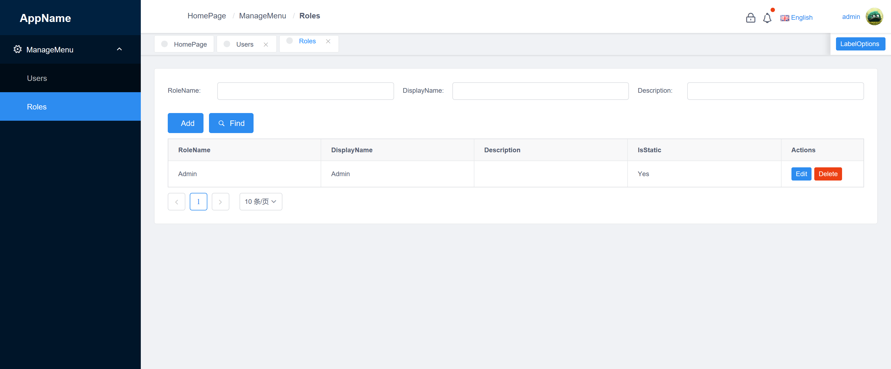

# ASP.NET Boilerplate VueJS Template

The Vue.js integration for ABP Boilerplate framework. This template is built on Vue+iview+Typescript.



## Getting Started

### Installing


```sh
cd vue
yarn install 
```

And then start

```
yarn serve
```

## Deployment

```sh
yarn build
```

## Built With

* [Vue](https://vuejs.org/) - The Progressive JavaScript Framework
* [Typescript](https://www.typescriptlang.org/) - Used for static typing
* [Vuex](https://vuex.vuejs.org/) - Vuex is a state management pattern + library for Vue.js applications. 
* [iView](https://www.iviewui.com/) - A High quality and rich functions, friendly APIs, free and flexible UI Toolkit based on Vue.js.

