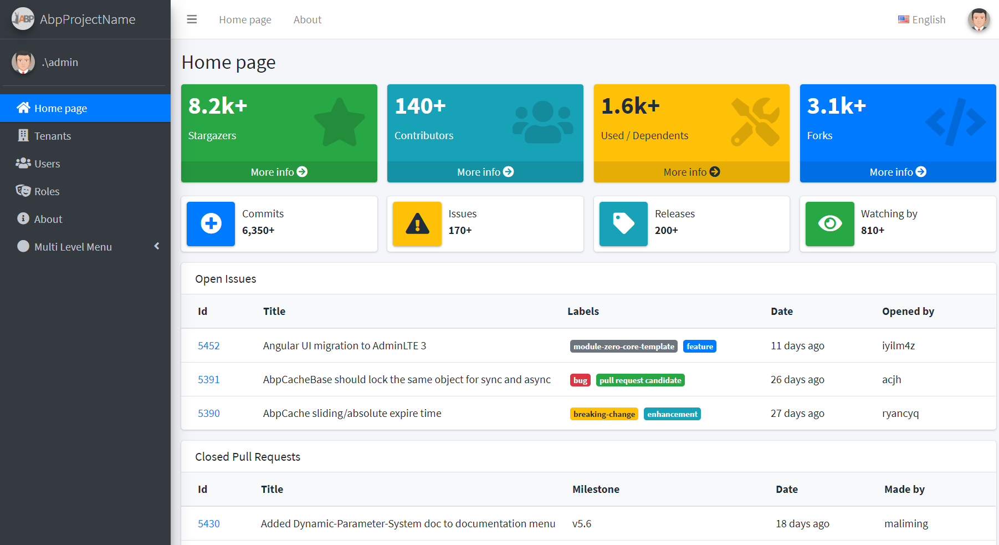
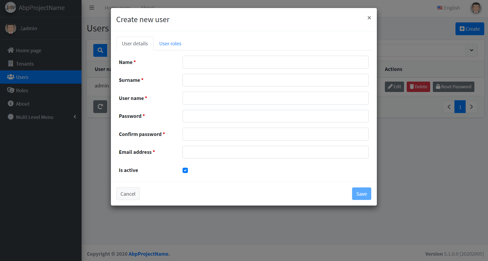

# Introduction

This is a template to create **ASP.NET Core MVC / Angular** based startup projects for AspNet Boilerplate. It has 2 versions:

1. [ASP.NET Core MVC & jQuery](https://aspnetboilerplate.com/Pages/Documents/Zero/Startup-Template-Core) (server rendered multi-page application).
2. [ASP.NET Core & Angular](https://aspnetboilerplate.com/Pages/Documents/Zero/Startup-Template-Angular) (single page application).
 
# Download

Create & download your project from https://aspnetboilerplate.com/Templates

# Screenshots

#### Sample Dashboard

#### User Creation Modal

# Documentation

* [ASP.NET Core MVC & jQuery version.](https://aspnetboilerplate.com/Pages/Documents/Zero/Startup-Template-Core)
* [ASP.NET Core & Angular  version.](https://aspnetboilerplate.com/Pages/Documents/Zero/Startup-Template-Angular)